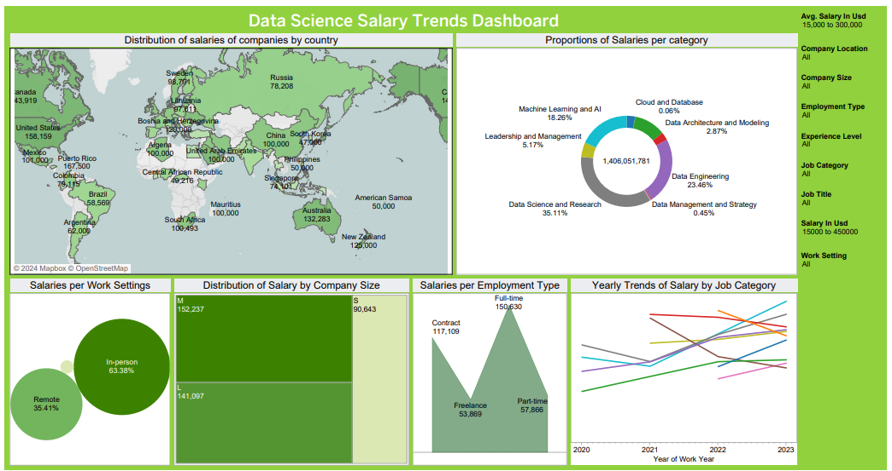
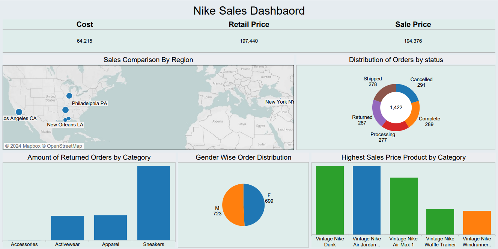
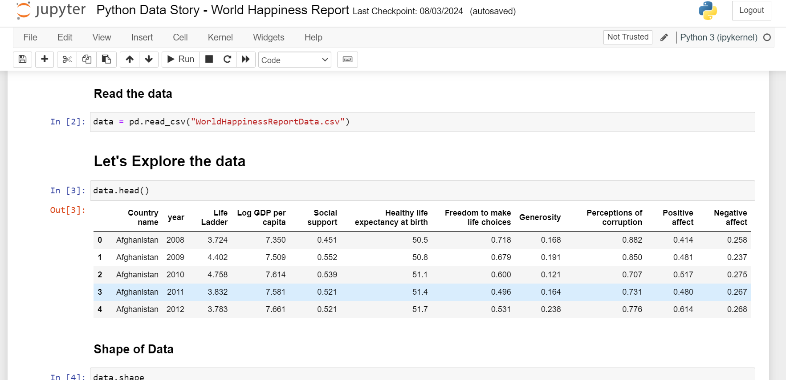
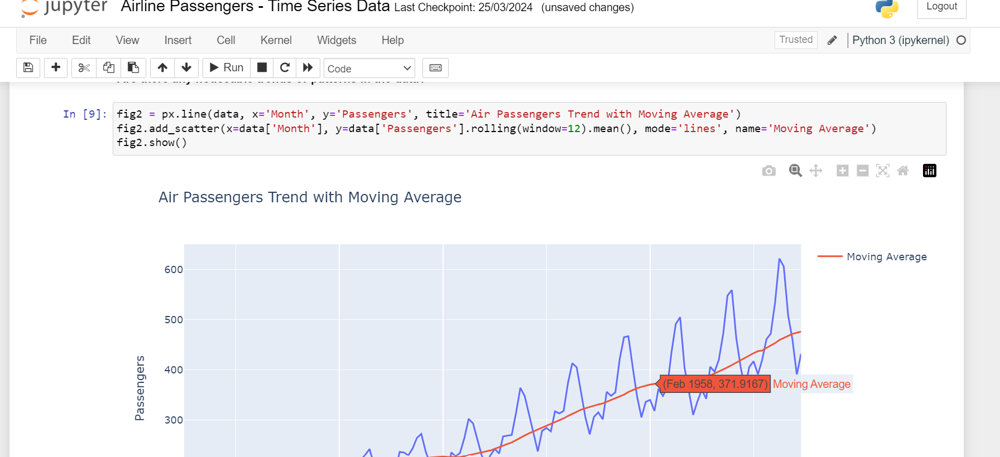
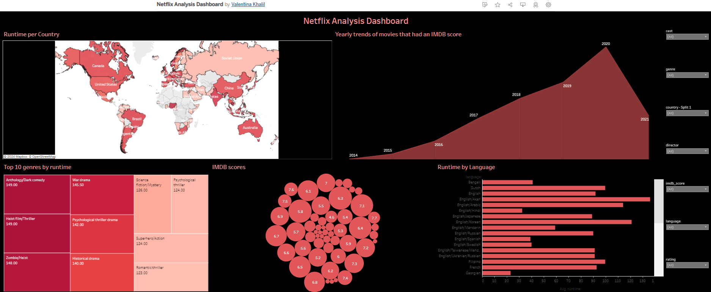

# Valentina Khalil
# Data Analyst

## Skills

### Soft Skills

#### Analytical Thinking, Problem-Solving, Communication, Collaboration, Attention to Detail, Time Management, Curiosity.

### Programming Languages: 
Python, Sql

### Libraries/Frameworks: 
Pandas, Numpy, Matplotlib, Seaborn

### Tools / Platforms: 
Tableau, Microsoft Offce, MySQL

### Databases:
MySQL, PostgreSQL, SQL Server

## Projects / Open-Source

# Data Science Salary Explorer: Unveiling Compensation Trends 
## Tools Used (Python, Tableau)

### Introduction:

Welcome to the Data Science Salary Explorer! This interactive dashboard offers a comprehensive exploration of the trends and insights in data science job salaries over time, derived from a dataset obtained from Kaggle. Leveraging the power of Python for data preprocessing and Tableau for visualization, I've transformed raw data into actionable insights that shed light on the evolving landscape of data science compensation.

[VizLink](https://public.tableau.com/views/DataScienceSalaryTrendsDashboard_17137992923300/Dashboard1?:language=en-GB&:sid=&:display_count=n&:origin=viz_share_link)

Key Features:
Dynamic Visualizations: Dive deep into the data with dynamic visualizations that allow you to explore various aspects of data science salaries. From geographical distribution to salary trends over time, each chart provides valuable insights into the factors influencing compensation in the field.

Interactive Filters: Customize your analysis using interactive filters to drill down into specific regions, job roles, or experience levels. Whether you're interested in entry-level salaries in a particular city or senior-level compensation trends across industries, the dashboard empowers you to tailor the analysis to your needs.

Salary Comparisons: Compare salaries across different job titles, industries, and locations to gain a holistic understanding of compensation trends in the data science domain. Identify emerging patterns and disparities to inform your career decisions or recruitment strategies.

Predictive Analytics: Explore predictive models that forecast future salary trends based on historical data, offering valuable insights for workforce planning and talent acquisition strategies.

How It Works:
Data Acquisition: The dataset was sourced from Kaggle, a leading platform for data science enthusiasts, ensuring reliability and relevance.

Data Preprocessing: Using Python, I performed data cleaning and preprocessing to ensure the accuracy and consistency of the dataset. This involved handling missing values, standardizing formats, and encoding categorical variables.

Data Visualization: Leveraging Tableau's intuitive interface and powerful visualization capabilities, I created interactive dashboards that transform raw data into visually compelling insights. Through carefully crafted charts, graphs, and maps, complex salary trends are made accessible and actionable.

Insight Generation: By combining technical expertise with domain knowledge, I extracted meaningful insights from the data, uncovering patterns, outliers, and correlations that drive informed decision-making in the realm of data science salaries.

Conclusion:

The Data Science Salary Explorer serves as a valuable resource for professionals, recruiters, and aspiring data scientists alike, offering unparalleled insights into the dynamics of compensation in the field. Whether you're navigating job markets, optimizing recruitment strategies, or exploring career opportunities, this dashboard equips you with the knowledge needed to succeed in the ever-evolving world of data science.

Explore the dashboard today and unlock the insights that will propel your career forward!

# Nike Sales Analysis: SQL and Tableau Project

### Introduction:

Welcome to the Nike Sales Analysis project, where I combined SQL querying with Tableau visualization to gain insights into Nike's sales data. Leveraging PostgreSQL as the database backend, I performed data extraction and analysis through SQL queries, followed by visualization and dashboard creation using Tableau. Let's delve into the details of the analysis and the insights uncovered along the way.

### SQL Analysis:

Queries 1-7:

Total Orders by Gender: Analyzed the distribution of orders based on gender to understand Nike's customer demographics.
Status of Orders: Investigated the status of orders to assess order fulfillment and customer satisfaction.
Cost per Category greater than 70: Explored product categories with costs exceeding $70 to identify high-cost areas.
Products Returned per Category: Examined product returns across different categories to pinpoint areas of concern for Nike.
Highest Sales per Distribution Center: Identified distribution centers with the highest sales to optimize inventory management and distribution strategies.
Total Amount of Orders that have been Completed: Calculated the total number of completed orders to measure overall sales performance.
Top 10 Products with Highest Retail Price and Cost: Ranked the top products based on their retail price and cost to highlight high-value items in Nike's inventory.

[PDF_Link]()

Tableau Visualization:
After extracting and analyzing the data using SQL, I imported the results into Tableau to create dynamic visualizations and dashboards. The Tableau dashboard showcases key metrics and trends in Nike's sales data, allowing stakeholders to interactively explore the insights uncovered through SQL analysis.

[VizLink](https://public.tableau.com/views/NikeDashboard_17137990242930/Dashboard1?:language=en-GB&:sid=&:display_count=n&:origin=viz_share_link)

Conclusion:

The Nike Sales Analysis project demonstrates my proficiency in leveraging SQL and Tableau to extract, analyze, and visualize data for informed decision-making. By combining SQL querying skills with Tableau visualization capabilities, I've provided valuable insights into Nike's sales performance, customer demographics, and product trends. This project serves as a testament to my ability to derive actionable insights from raw data and communicate them effectively through compelling visualizations.

Explore the Tableau dashboard to uncover the nuances of Nike's sales data and gain valuable insights into the factors driving success in the competitive retail industry.

# Python Data Story - World Happiness Report

### Introduction:

Welcome to my Python Data Story project, where I explore the World Happiness Report dataset sourced from Kaggle. In this project, I delve into the fascinating world of global happiness and examine the relationships among various variables to uncover insights into what factors contribute to overall happiness.

Data Exploration:

Using Python, I downloaded and preprocessed the World Happiness Report dataset, ensuring it was clean and ready for analysis. The dataset contains a wealth of information, including country-level data on factors such as GDP per capita, social support, life expectancy, freedom to make life choices, generosity, and perceptions of corruption.

Key Visualizations:

Correlation Heatmap: I started by creating a correlation heatmap to visualize the relationships between different variables. This provided an overview of which factors are strongly correlated with happiness and which factors have weaker correlations.
Scatter Plots: I then proceeded to create scatter plots to explore specific relationships in more detail. For example, I plotted GDP per capita against happiness score to see if there's a clear relationship between wealth and happiness. Similarly, I examined the relationship between social support and happiness, freedom to make life choices and happiness, and other relevant variables.
Bar Charts: To compare the average happiness scores across different regions or countries, I created bar charts. This allowed me to identify which regions or countries tend to have higher levels of happiness and which ones lag behind.
Line Plots: Finally, I used line plots to visualize trends over time. By plotting happiness scores over multiple years, I could observe whether there have been any significant changes in global happiness levels over time and whether certain factors have become more or less influential over the years.
Insights:

Through this data exploration process, I gained several insights into the determinants of happiness worldwide. For instance, I discovered that while GDP per capita does have a positive correlation with happiness, it's not the sole determinant. Factors such as social support, freedom to make life choices, and perceptions of corruption also play significant roles in determining a country's happiness level.

Conclusion:

The Python Data Story - World Happiness Report project not only showcases my data analysis and visualization skills but also provides valuable insights into the complex factors that contribute to happiness on a global scale. By examining the relationships among various variables, I've gained a deeper understanding of what truly makes people happy and how policymakers and individuals alike can work towards creating happier societies.

Explore the visualizations and insights in this project to gain a new perspective on the factors that drive happiness around the world.

[Kaggle_Notebook_Link]()

# Python Time Series Analysis - Airline Passengers Dataset

### Introduction:

Welcome to my Python time series analysis project, where I've explored the Airline Passengers dataset. This dataset, sourced from an open repository on GitHub, contains monthly airline passenger numbers from 1949 to 1960. Leveraging Python for data exploration and Plotly for interactive graphing, I've conducted a comprehensive analysis of the dataset to uncover insights into passenger trends over time.

Data Exploration:

Using Python libraries such as Pandas and Plotly, I've loaded and preprocessed the Airline Passengers dataset. This involved parsing dates, handling missing values, and ensuring the dataset's suitability for time series analysis.

Key Analyses:

Time Series Plot: I began by creating a time series plot to visualize the overall trend in airline passenger numbers over the entire period. This provided an initial understanding of how passenger numbers have evolved over time.
Seasonal Decomposition: Next, I performed seasonal decomposition to separate the time series into its trend, seasonal, and residual components. This allowed me to identify any recurring patterns or seasonal fluctuations in passenger numbers.
Trend Analysis: I conducted a detailed analysis of the trend component to identify long-term growth or decline trends in airline passenger numbers. This involved fitting trend lines and analyzing their slopes over different time intervals.
Seasonal Analysis: I explored the seasonal component to understand the seasonal variations in passenger numbers throughout the year. By visualizing seasonal patterns and calculating seasonal indices, I gained insights into peak travel seasons and off-peak periods.
Interactive Graphs:

Utilizing Plotly, I created interactive graphs that enable users to explore the data dynamically. These interactive visualizations allow users to zoom in on specific time periods, hover over data points for detailed information, and customize the display to focus on specific aspects of the data.

Insights:

Through this time series analysis, I uncovered several insights into the trends and patterns in airline passenger numbers. For example, I identified seasonal peaks during holiday seasons and summer months, as well as long-term growth trends reflecting the expansion of air travel over the decades.

Conclusion:

The Python Time Series Analysis - Airline Passengers Dataset project demonstrates my proficiency in conducting time series analysis and visualizing data using Python and Plotly. By exploring the historical trends in airline passenger numbers, I've provided valuable insights that can inform strategic decision-making in the aviation industry and guide forecasting efforts for future passenger demand.

Explore the interactive graphs and insights in this project to gain a deeper understanding of the dynamics of airline passenger numbers over time.

[Kaggle_Notebook_Link]()

# Netflix Dashboard: Exploring Runtimes and IMDb Scores

### Introduction:

Welcome to the Netflix Dashboard! In this Tableau dashboard, I've analyzed Netflix movies and TV shows to uncover insights into their runtimes and IMDb scores. Leveraging Tableau's powerful visualization capabilities, I've created an interactive dashboard that allows users to explore the relationships between runtime durations, IMDb scores, and other relevant variables.

[Tableau_Public](https://public.tableau.com/views/NetflixAnalysisDashboard_17136962822250/Dashboard1?:language=en-GB&:sid=&:display_count=n&:origin=viz_share_link)

Key Features:

Runtimes Distribution: The dashboard provides an overview of the distribution of runtime durations for Netflix content, allowing users to see the range of durations and their frequencies.
IMDb Scores Distribution: Users can explore the distribution of IMDb scores for Netflix content, gaining insights into the overall quality and popularity of movies and TV shows on the platform.
Correlation Analysis: The dashboard includes visualizations that explore the relationship between runtime durations and IMDb scores. Users can investigate whether there is a correlation between longer runtimes and higher IMDb scores, or if other factors influence ratings.
Filtering Options: Interactive filters allow users to narrow down their analysis based on various criteria, such as genre, release year, or content type (movies vs. TV shows). This enables users to focus on specific subsets of Netflix content for deeper insights.
Insights:

Through the Netflix Dashboard, users can uncover valuable insights into the relationship between runtime durations and IMDb scores for Netflix movies and TV shows. For example, they may discover that certain genres tend to have longer runtimes or that there is a positive correlation between runtime duration and IMDb scores for specific types of content.

Conclusion:

The Netflix Dashboard offers a comprehensive exploration of Netflix content, focusing on the key factors of runtime durations and IMDb scores. By providing interactive visualizations and filtering options, users can gain valuable insights into the characteristics and quality of movies and TV shows available on the platform.

Explore the Netflix Dashboard today to uncover insights that can inform your viewing choices and deepen your understanding of Netflix content trends!

